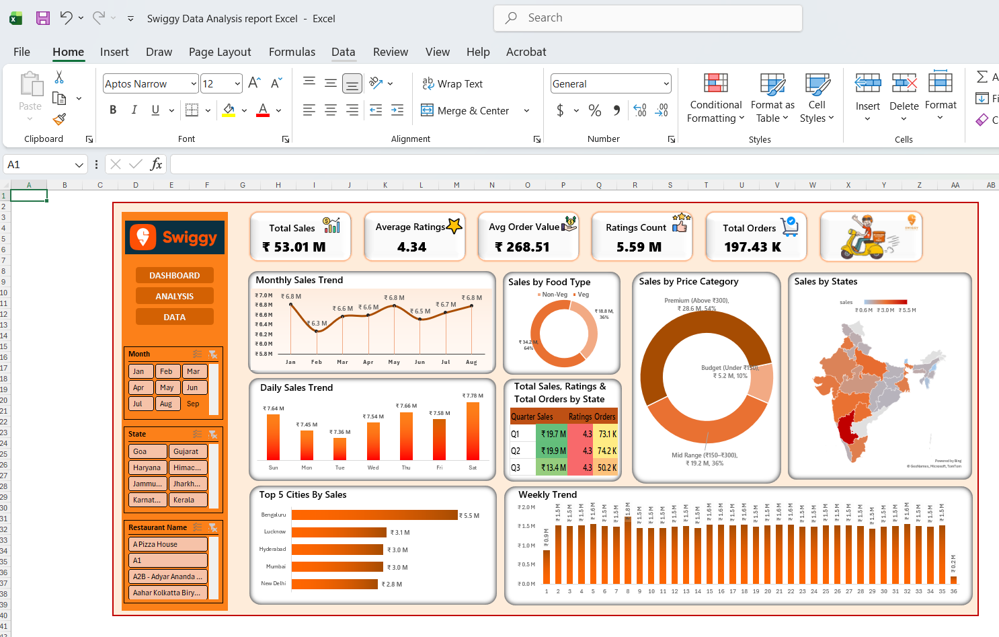

# Swiggy Data Analysis Dashboard

## Project Overview
This project focuses on analysing food ordering behaviour across multiple cities using an interactive Excel dashboard. The analysis explores demand patterns, pricing trends, restaurant performance, and customer preferences.

The goal of this project is to transform raw food delivery data into meaningful business insights that can help improve operational planning, marketing strategies, and customer experience.

## Objectives
- Analyse food order trends across cities
- Compare weekend vs weekday demand patterns
- Identify top performing restaurants and dishes
- Understand pricing behaviour and customer preferences
- Generate business insights using data visualisation

## Tools Used
- Microsoft Excel
- Pivot Tables
- Data Cleaning
- Data Categorisation
- Interactive Dashboard Design

## Key Insights
- Weekend demand is significantly higher compared to weekdays
- Bengaluru shows the highest order volume among all cities
- Vegetarian food dominates the majority of orders
- Premium-range pricing (Above–₹300) drives the largest share of purchases
- Fast food chains generate high order volumes

## Business Recommendations
- Increase staffing and delivery capacity during weekends
- Expand vegetarian menu options in high-demand areas
- Focus marketing campaigns on top-performing cities
- Optimise pricing strategies around mid-range price segments

## Dashboard Preview

## Project Structure
Data – Raw dataset  
Dashboard – Excel dashboard file  
Images – Dashboard screenshots
